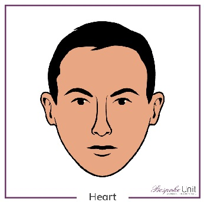

# Vladimir Naiberger
### Junior JavaScript Developer 



### **Contacts:**
##### Email: Semarglll@gmail.com
##### Telegram: @semarglll
##### [*My GitHub*](https://github.com/Semarglll)

### Summary
I graduated in 2013 at S. Seifullin Kazakh AgroTechnical university in the department of computer engineering and software. Then I worked for several years in the field of civil engineering. As a Senior engineer of the production and technical department. Received a second higher education. And I realized that I did not want to be an civil engineer in construction. Then I decided to return to IT. I considered the vacancy of a Software testing engineer. But I realized that I can not only test, but also create code. And signed up for an RSS training.

### Skills
  
* C++ (basic long time ago)
* Html (basic)
* CSS (basic)
* XML (basic)
* SQL (basic)
* MySQL (basic)
* Git (basic)

### Code examples (LATEST)
  Some code example from my task at the Codeacademy:
  ```Html
  <!DOCTYPE html>
<html lang="en" dir="ltr">
  <head>
    <meta charset="utf-8">
    <title>Sign Up Page</title>
    <link rel="stylesheet" href="style.css" type="text/css">
    <link href="https://fonts.googleapis.com/css?family=Fjalla+One" rel="stylesheet">
  </head>
  <body>
    <section class="overlay">
			<h1>Sign Up</h1>
      <p>Create an account:</p>
      <form action="submission.html" method="GET">
        <label for="username">Username:</label>
        <br>
				<input id="username" name="username" type="text" required minlength="3" maxlength="15">
        <br>
        <label for="pw">Password:</label>
        <br>
        <!--Add the pattern attribute to the input below-->
				<input id="pw" name="pw" type="password" required minlength="8" maxlength="15">
        <br>
        <input type="submit" value="Submit">
      </form>
    </section>
  </body>
</html>

  ```

### Experience 
  
Participating in the rsschool project is my first programming experience. And I think this is the first step for my future

### Education
  
[*My Codeacademy achievements*](https://www.codecademy.com/users/Semarglll/achievements)
  
International internship at the University of Putra Malaysia. 07/10/2013-23/10/2013
  
Scrum Lego Training, Nur-sultan. 09/07/2019

### English
  
I have been studying English for six months in "Littera School", Nur-Sultan. Reached level B1 + (Low Upper-Intermediate). 
